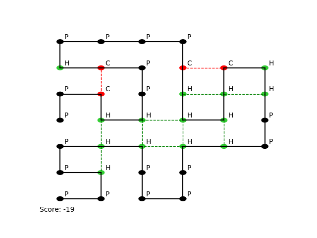

# MinProg-AH: Protein Po(w)der
Jarec Schouten, Joël van Ingen & Wolf Gautier

## Case Uitleg


## Run
By running main.py, there is a small UI in the terminal that allows the user to enter a sequence and select an algorithm alongside paramaters and heuristcs.
More information on these parameters and heuristics is read below.

## Separate Experiments (milestone)
To run timed tests on (i.e. simulated annealing) algorithm: run experiments/iterate_sa.py, adjust sequence and timing as necessary.

## Algorithms
**Brute Force**: Tries all possible combinations. Given enough time, this algorithm will find the best shape, but is impractical to run for sufficiently large proteins.

**PureRandom**: Generates a random list of directions, ensures it's valid and computes the resulting score.

**IterativeRandom**: Loops through the protein, and finds the available directions for each node separately, trying to prevent collisions.

**Spiral**: Arranges the protein in a spiral shape.

**Greedy**: Loops through the protein, and bends each node into the most favourable position based on score, or chooses a random direction otherwise.

**Regression**: Makes a number of random folds, only keeping the new shape if it has a better score than the previous shape.

**Simulated Annealing**: Similar to *Regression*, but has a (each iteration decreasing) chance that a new shape will be accepted even if it is worse.

**Depth First**: Recursively loops through the protein, and tries all directions in a depth-first approach. Tries directions in an order based on selected heuristics and prunes branches if they're not promising enough.

**Beam Search**: Explores position that has the highest points at that moment. Saves others in a queue.

## Parameters

**Dimensions**: The user can choose whether they want to run the algorithm in 2D or 3D.

**Debugging**: Outputs internal data describing at where the algorithm is at that point. (ONLY USE IF ALGORITHM CRASHES)

**Verbose**: Outputs more global information, i.e. when the algorithm has found a new best score.

**Progressbar**: Displays a progressbar while running.

**State History**: Allows the algorithm to save previous states to enable the user to animate the algorithm.

**Max Iterations**: Caps the amount of iterations the algorithm is allowed to run for.

### DepthFirst Heuristics: Only available in the DepthFirst algorithm

**MinimiseDimensions**: Nudges the algorithm in directions where the overall dimensions of the protein are kept as small as possible.

**PotentialPlus**: Nudges the algorithm in directions where hydrophobic nodes are kept together and polar nodes are placed further away.

**FoldAmount**: Nudges the algorithm in directions where the protein makes the most amount of 90 degree folds.


## Voorbeeld Run

De UI in the terminal looks as followed:
```
/Users/jarecs/Documents/MinorProgramming/AH/MinProg-AH/.venv/bin/python /Users/jarecs/Documents/MinorProgramming/AH/MinProg-AH/main.py 
Enter sequence: PPCHHPPCHPPPPCHHHHCHHPPHHPPPPHHPPHPP
Available algorithms:
[0] PureRandom
[1] IterativeRandom
[2] Spiral
[3] BruteForce
[4] Regression
[5] SimulatedAnnealing
[6] Greedy
[7] BeamSearch
[8] DepthFirst
Choose an algorithm 0-8: 8
Choose a number of dimensions (2 / 3): 2
Change parameter max_iterations (default 5000)? (y/n): y
Set parameter max_iterations to: 20000
Change parameter prune_alpha (default 0.5)? (y/n): n
Change parameter prune_beta (default 15)? (y/n): y
Set parameter prune_beta to: 12
Use debugging? (y/n): n
Keep state history for animating? (y/n): n
Use progressbar? (y/n): y
Output verbose information? (y/n): n
Add heuristic MinimiseDimensions? (y/n): y
Add heuristic PotentialPlus? (y/n): n
Add heuristic FoldAmount? (y/n): n
 98%|█████████▊| 19691/20000 [00:04<00:00, 4562.28it/s]

Final score: -19
20001it [00:05, 3966.01it/s]                           

Process finished with exit code 0
```
Once this is run, the user will be able to find a plot of the protein in the `./experiments/output` folder.


<div align="center">
<figure>
    
    <figcaption>Output DepthFirst Algorithm</figcaption>
</figure>
</div>